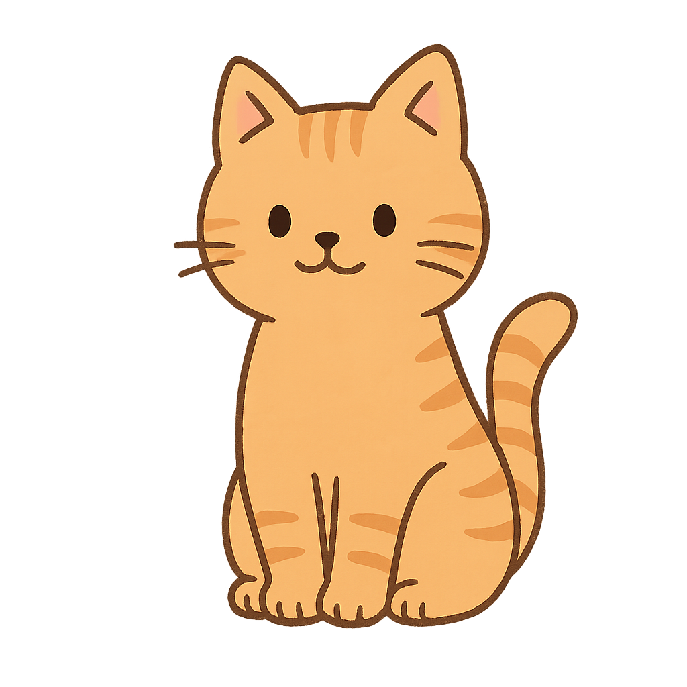

# 고양이 편지 - Healing Cat Letter Game

> 조용한 마을에 살고 있는 한 고양이,  
> 당신은 그 고양이가 되어 마을 사람들의 하루에 다가갑니다.  
> 말 없이, 조용히, 따뜻하게.

---

## 🌸 소개

《고양이 편지》는  
**짧은 분기형 일상 힐링 게임**입니다.  
당신은 고양이가 되어 마을 사람들과 하루하루를 보내며,  
그들의 감정을 조용히 어루만져 줍니다.

작은 행동 하나로 누군가의 하루가 달라질 수 있어요.

---

## 🎮 플레이 방법

1. 고양이의 이름을 입력합니다. (최대 6자)  
2. 각 날마다 **선택지**가 주어집니다.  
3. 선택에 따라 마을 사람의 감정과 반응이 달라집니다.  
4. 마지막 날, 고양이인 당신에게 **편지**가 도착합니다.

---

## 🧶 기술 스택

- HTML / CSS / JavaScript (Vanilla)
- GitHub Pages 배포
- 반응형 UI, 투명 PNG 일러스트 사용

---

## 🖼️ 게임 화면 예시

> 

---

## 🔗 온라인 플레이

👉 [게임 바로가기](https://simless786.github.io/cat-letter-game/](https://simless786.github.io/simple_cat_game/)  

---

## 📜 라이선스

본 프로젝트는 자유롭게 포크/수정/배포 가능하지만,  
일러스트(cat.png)는 개인 프로젝트용으로만 사용해주세요.
일러스트는 생성형 AI를 이용했습니다.

